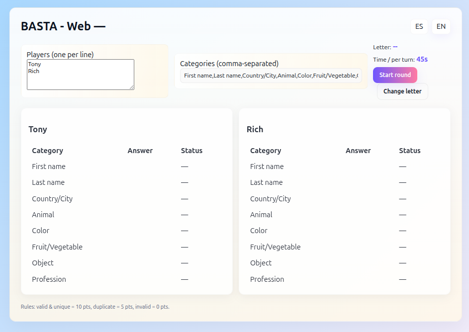
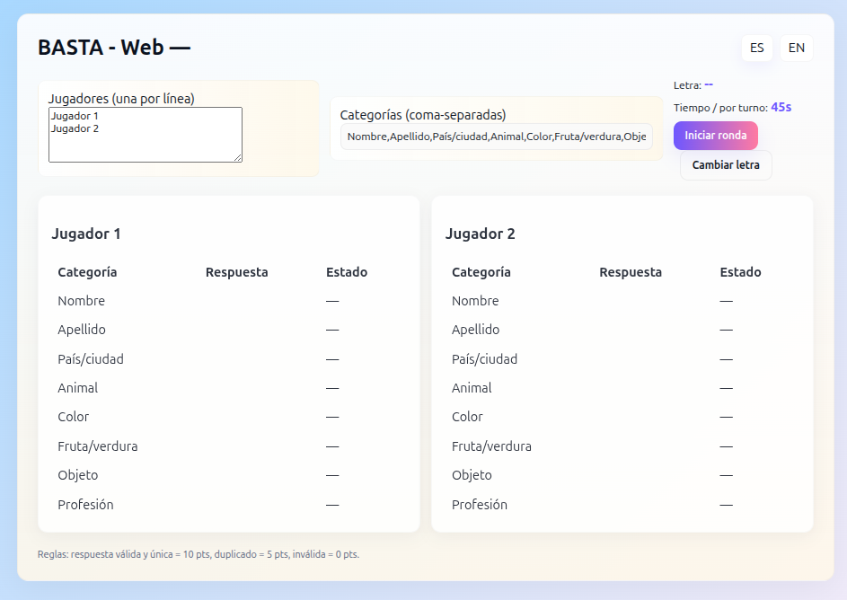

# BASTA - Web

Professional, lightweight web implementation of the traditional Mexican party game "BASTA" (also known as Tutti Frutti / Scattergories).

Features
- Local multiplayer (multiple players on same device)
- Easy setup: no build tools required (uses ESM React from CDN)
- Configurable categories and timer
- Simple scoring (unique answers rewarded)

Quick start
1. Serve the directory: `python3 -m http.server 8000`
2. Open `http://localhost:8000` in your browser

Development
- The app is a single-file React app (app.js) that loads React from a CDN for simplicity.
- To make changes, edit `app.js`, `index.html`, and `style.css`.

Repository contents
- `index.html` - app shell
- `app.js` - React UI and game logic
- `style.css` - styles
- `LICENSE` - MIT license
- `README.md` - this document

Contributing
- Fork the repository, make changes, and open a pull request.

License
This project is licensed under the MIT License - see the LICENSE file for details.

Maintainer: NullLabTests

## Screenshots

Spanish mode (in-app):

English mode (in-app):

